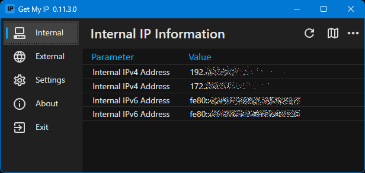
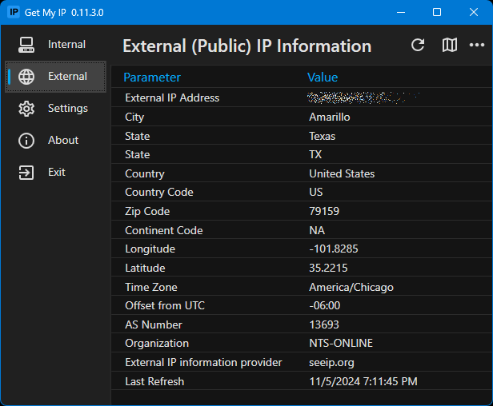

  

<h1 align="center">
  Get My IP
</h1>

  

**Get My IP shows IP address and geolocation information for your computer.**

#### Get My IP runs on .NET 8. 
Self-contained versions are available if .NET 8 isn't installed. See the [releases page](https://github.com/Timthreetwelve/GetMyIP/releases).

### Get My IP is multilingual!
Languages are being added as of version 0.9.0. Please see [Contribute a Translation](https://github.com/Timthreetwelve/GetMyIP/wiki/Contribute-a-Translation) topic in the Wiki if you would like to contribute a translation. 

### Features

* Shows internal and external IP addresses.
* Shows geolocation data for the external IP address.
* Choose from _multiple_ geolocation data providers.
* Shows all internal IP addresses if there are more than one.
* Optionally write _external_ IP information to a log file.
* Opens the default browser showing a map with the latitude and longitude found in the geolocation information.
* Choose between Google Maps, Bing Maps, or LatLong.net to display map.
* Optionally shows IPv6 addresses for internal addresses.
* Copy data to the clipboard in tab delimited format. Perfect for pasting into Excel.
* Save data to a tab delimited text file.
* Select light or dark, or darker theme and one of 20 accent colors.
* Minimize to tray. 
* Customize the details shown in the tray icon [tooltip](https://github.com/Timthreetwelve/GetMyIP?tab=readme-ov-file#tray-icon).
* Optional automatic refresh and notification when _external_ IP address changes.

### Download Get My IP

You can download the latest release from the [releases page](https://github.com/Timthreetwelve/GetMyIP/releases). Note that a "portable" releases are provided as well as the traditional installers.

### Screenshots

#### Internal

#### External

#### Tray Icon

*Some data has been obscured or faked for privacy*

